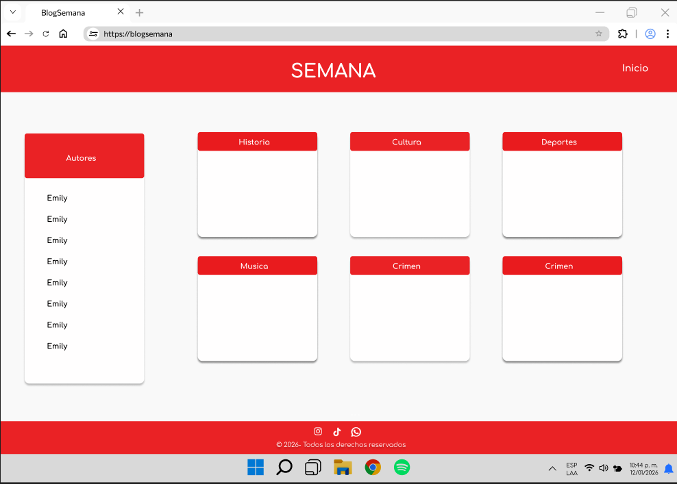

# Blog App — Technical Test

## Features
- 📰 Listado de posts con paginación
- 🏷️ Filtro por tags
- 👤 Filtro por autor desde sidebar
- 💬 Detalle de post con comentarios y reacciones
- 🔐 Ruta protegida con Google Sign-In (Firebase)
- 👥 Listado de usuarios con foto (solo autenticados)

## Tech Stack
React 18 · Vite · React Router v6 · TanStack Query v5
Zustand · Firebase Auth · Tailwind CSS

## Run locally
cp .env.example .env  # fill in Firebase credentials
npm install && npm run dev

## Architecture decisions
- TanStack Query para cache y loading states sin Redux
- Zustand con persist para mantener sesión al recargar
- Routing por URL para el detalle del post (SEO-friendly)
- API layer centralizado en /src/api para fácil testing